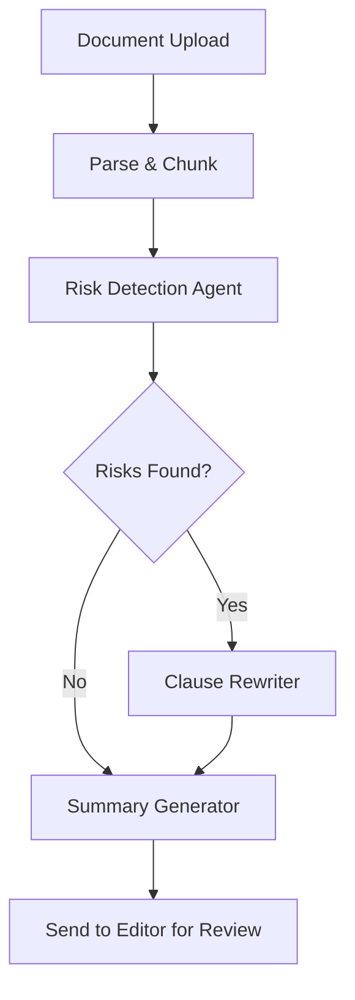

Absolutely! Here's a **production-ready `README.md`** for your full-stack LangChain project **LegalGenie**, with full integration details, **real-time editing**, **semantic search**, and **Gemini** as the LLM provider.

---

```markdown
# ⚖️ LegalGenie – AI-Powered Legal Assistant with LangChain, Gemini, and Realtime Editing

**LegalGenie** is a full-stack web application that uses **LangChain**, **Gemini Pro LLM**, and a **rich text editor** to deliver real-time, AI-assisted legal document analysis, Q&A, red-flag detection, and intelligent rewriting of legal clauses.

Built using **React**, **Tailwind CSS**, **FastAPI**, and **Pinecone**, the platform combines Retrieval-Augmented Generation (RAG), multi-agent workflows via LangGraph, and rich document editing—all in a seamless experience.

---

## 🧠 Core Features

- 📄 Upload legal documents (PDF, DOCX, TXT)
- 🔍 Ask AI legal questions about your document (RAG-based Q&A)
- ✍️ Real-time AI-assisted clause editing and rewriting
- 🚨 Red flag detection (e.g. liability, vague terms)
- 🧾 Auto-generate new documents (e.g. NDAs, MoUs)
- 🔁 Editable rich-text interface with live updates
- 🧠 Memory + multi-step review using LangGraph
- 🌐 Gemini Pro as the primary LLM for all tasks

---

## 🧱 Architecture Overview

| Component | Tech |
|----------|------|
| 💻 Frontend | React + Tailwind + shadcn/ui + Tiptap Editor |
| 🔧 Backend | FastAPI + LangChain |
| 🧠 LLM | Gemini Pro (via Vertex AI or API) |
| 📁 Storage | Supabase / Firebase |
| 📦 Vector DB | Pinecone (chunked semantic retrieval) |
| 🔐 Auth | Supabase / Firebase Auth |

---

## 🔄 Real-Time Editing + Semantic Search Explained

### 🧠 Why Pinecone + DB?

LegalGenie stores the **same document in two forms**:

| Use Case | Where It’s Stored | Format |
|----------|-------------------|--------|
| AI Search / RAG | Pinecone | Text chunks as embeddings |
| Editing / Display | Firestore / Supabase | Full plain text |

### 🔄 Workflow

1. User uploads a document
2. Backend splits it into chunks → sends to Pinecone
3. Full document text stored in DB
4. React loads full text in a rich editor (Tiptap)
5. User edits document and uses AI to:
   - Ask questions (uses Pinecone chunks)
   - Rewrite clauses (sends selected text to LLM)
6. Saved edits update full doc in DB and (optionally) update chunks in Pinecone

---

## 🌐 LangChain + Gemini Use Cases

| Task | LangChain Tools |
|------|-----------------|
| Q&A on documents | `ConversationalRetrievalChain` + `Gemini` |
| Clause rewriting | `LLMChain` + `PromptTemplate` |
| Red flag analysis | `LangGraph` multi-agent pipeline |
| Clause generation | `Tool` + `GeminiFunctionCall` |
| Multi-step reviews | `StateGraph`, `ConditionalEdges` |
| Tracing & logging | LangSmith (optional) |

---

## 📁 Project Structure

```

legalgenie/
├── client/            # React + Tailwind frontend
│   ├── components/
│   ├── pages/
│   └── utils/
├── backend/           # FastAPI + LangChain backend
│   ├── routes/
│   ├── agents/
│   └── langgraph/
├── docs/              # Screenshots, diagrams
└── README.md

````

---

## 🚀 Quickstart

### 🔹 1. Clone the Repo

```bash
git clone https://github.com/yourname/legalgenie.git
cd legalgenie
````

### 🔹 2. Frontend Setup

```bash
cd client
npm install
npm run dev
```

### 🔹 3. Backend Setup

```bash
cd backend
python -m venv venv
source venv/bin/activate
pip install -r requirements.txt
uvicorn main:app --reload
```

---

## 🔐 Environment Variables

### `/client/.env`

```env
VITE_API_URL=http://localhost:8000
VITE_SUPABASE_URL=your_url
VITE_SUPABASE_KEY=your_key
```

### `/backend/.env`

```env
GOOGLE_API_KEY=your_gemini_api_key
PINECONE_API_KEY=your_pinecone_key
PINECONE_ENVIRONMENT=your_pinecone_env
PINECONE_INDEX_NAME=legalgenie-index
```

---

## 📸 Screenshots

| Rich Text Editing          | Q\&A Assistant     |
| -------------------------- | ------------------ |
|  |  |

---

## 💡 Example Prompts

* “What are the early termination clauses?”
* “Rewrite the indemnification section to favor the employee.”
* “Detect any ambiguous obligations.”
* “Generate a basic NDA between a startup and a freelancer.”

---

## 🔮 LangGraph Workflow Example



Each node is powered by a different LangChain agent using Gemini and custom tools.

---

## 📌 Future Features

* Voice-to-contract (Whisper + Gemini)
* Clause similarity map
* AI-generated negotiation suggestions
* Multi-language contract support
* Blockchain-stored signed contracts

---

## 🙌 Contributing

1. Fork the project
2. Make changes
3. Submit a PR

We welcome all feature suggestions, bug reports, and improvements!

---

## 📜 License

MIT © 2025 \[Your Name]

---

## 🧠 Acknowledgments

* [LangChain](https://github.com/langchain-ai/langchain)
* [Gemini API](https://ai.google.dev/)
* [Pinecone](https://www.pinecone.io/)
* [Tiptap Editor](https://tiptap.dev/)
* [shadcn/ui](https://ui.shadcn.com/)

```

---

Would you like me to generate:
- 🧪 `requirements.txt` for backend (with LangChain + Gemini support)?
- 📦 `package.json` sample for the frontend?
- 🎨 Sample UI wireframes in Figma?
- 📁 GitHub repo scaffold (frontend + backend folders)?

Let me know what you need next!
```
